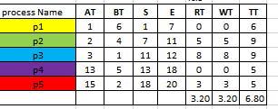
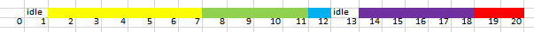
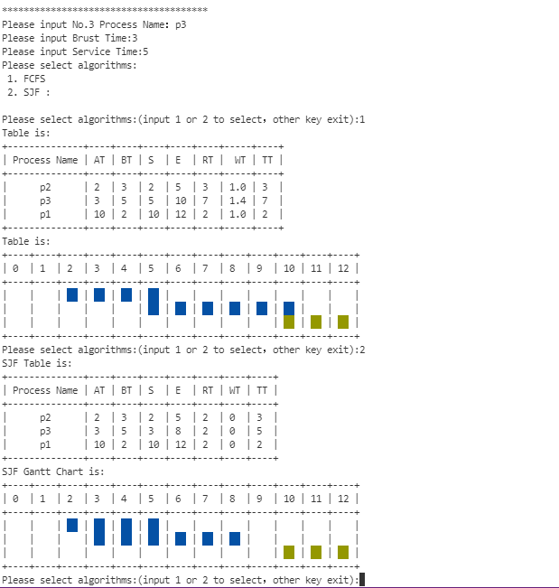
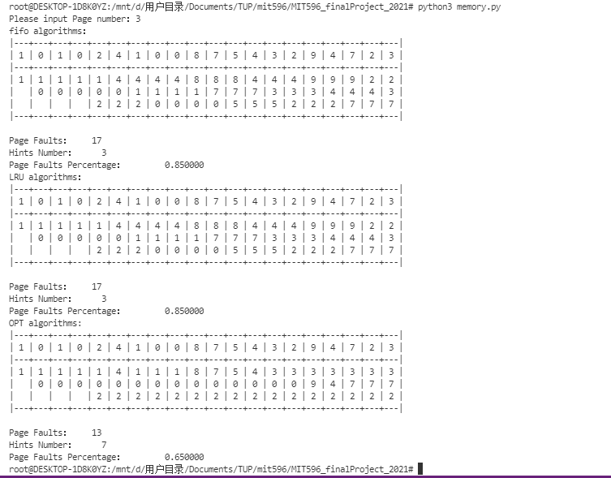

## Overview

this doc is  final exam in TUP MIT596

[中文说明](./README_Chinese.md) [English Doc](./README.md)

## Project Overview

### 1.CPU Scheduling algorithms (choose 1 non preemptive; 1 preemptive); 

could handle idle time

Inputs:   min of 3 processes and maximum 6 processes; arrival time should be varied
Outputs: Table (refer to the sample table)

Sample table



Gantt Chart




> Word instruction 
>
> BT = Burst Time 
>
> AT = Arrival Time 
>
> S = Start Time
>
> E = End Time
>
> RT = Time from process arrival until its “first execution” on the CPU
>
> WT= Waiting Time：
>
> TT = Time from process arrival to process completion.


### 2. Page Replacement Algorithms (FIFO, OPTIMAL and LRU);

Specs:

Input: minimum of 3 frames maximum of 5; reference string min of 20 chars; 

Output: simulation table	

​        Number of page faults

​		Number of hits


### 3.Disk Scheduling Algorithms

Specs:

Input: minimum of 3 frames maximum of 5; reference string min of 20 chars; 

Output: simulation table	

​        Number of page faults

​	Number of hits


## Quick start

```
# centos
yum install python

# ububut
apt install python3 python3-pip
pip3 install prettytable colorama

# windows
# Install python3 by yourself
pip3 install prettytable colorama
```


## result




